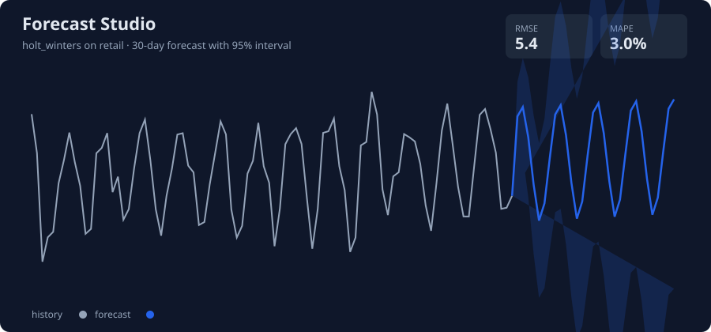

# Forecast Studio

A time series forecasting workbench: 6 models behind one interface, walk-forward backtesting, prediction intervals, and a Flask demo UI.



## Features

- **6 forecasters, one API**: naive, seasonal naive, moving average, Holt-Winters exponential smoothing, ARIMA, and lag-feature linear regression
- **Walk-forward backtesting**: expanding-window validation with MAE, RMSE, MAPE, sMAPE
- **Prediction intervals**: 95% bands from the ARIMA state-space model and from Holt-Winters residual variance
- **Feature engineering**: lag features, rolling means/stds, calendar effects (day of week, month, weekend)
- **Data**: synthetic generators (retail sales, web traffic, energy demand) plus CSV upload
- **Demo UI**: pick a dataset and model, get a forecast chart with intervals and backtest metrics

## Quickstart

```bash
pip install -r requirements.txt

# reproduce the benchmark table below
python scripts/benchmark.py

# launch the demo (http://localhost:5000)
python app.py

# run the test suite
pytest
```

Or try it in three lines:

```python
from src.data import generate_series
from src.forecast import ForecastStudio

df = generate_series(n=365, seed=7)
studio = ForecastStudio(model="holt_winters").fit(df)
print(studio.predict(horizon=30).head())
print(studio.backtest(horizon=14))
```

## Benchmark

5-fold expanding-window backtest, 14-day horizon, on synthetic series (trend + weekly seasonality + noise). Full results in `models/benchmark.json`.

Retail sales:

| model | mae | rmse | mape | smape |
| --- | --- | --- | --- | --- |
| holt_winters | 3.98 | 5.07 | 2.74 | 2.75 |
| linear_lags | 4.23 | 5.31 | 2.91 | 2.93 |
| seasonal_naive | 5.31 | 6.45 | 3.62 | 3.67 |
| arima | 6.28 | 7.33 | 4.38 | 4.36 |
| moving_average | 11.01 | 12.63 | 7.58 | 7.56 |
| naive | 11.19 | 13.62 | 7.87 | 7.67 |

Winners per dataset:

| dataset | winner | rmse | mape |
| --- | --- | --- | --- |
| retail | holt_winters | 5.07 | 2.74% |
| traffic | holt_winters | 161.27 | 5.01% |
| energy | linear_lags | 14.61 | 3.80% |

Takeaway: Holt-Winters dominates strongly seasonal series, while the lag-feature regression wins when yearly seasonality is in the mix. Baselines are there so every fancy model has to earn its keep.

## How it works

1. `src/data.py` generates synthetic series or loads your CSV (`ds`, `y` columns).
2. `src/features.py` builds lag, rolling-statistic, and calendar features.
3. `src/models.py` fits any of the 6 forecasters through `fit(df)` / `predict(h)`.
4. `src/backtest.py` runs expanding-window walk-forward validation and ranks models by RMSE.
5. `src/forecast.py` wraps it all in the `ForecastStudio` pipeline class.
6. `app.py` serves the demo: dataset + model + horizon in, chart + metrics + forecast table out.

## Project structure

```
forecast-studio/
├── app.py                 # Flask demo UI
├── templates/index.html
├── src/
│   ├── data.py            # synthetic series + CSV loader
│   ├── features.py        # lags, rolling stats, calendar features
│   ├── metrics.py         # MAE, RMSE, MAPE, sMAPE
│   ├── models.py          # 6 forecasters, one interface
│   ├── backtest.py        # walk-forward validation
│   └── forecast.py        # ForecastStudio pipeline
├── scripts/
│   ├── benchmark.py       # model comparison -> models/benchmark.json
│   └── make_demo.py       # generates sample.csv + demo.svg
├── data/sample.csv
├── models/benchmark.json
├── tests/                 # 37 pytest tests
└── screenshots/demo.svg
```

## Resume bullets

- Built a time series forecasting workbench in Python comparing 6 models (Holt-Winters, ARIMA, lag-feature regression, 3 baselines) under 5-fold walk-forward backtesting
- Implemented 95% prediction intervals and a Flask demo UI with dataset selection, CSV upload, and forecast visualization
- Best model hit 2.7% MAPE on 14-day retail forecasts; lag-feature regression won on series with yearly seasonality

## Tech

Python, statsmodels, scikit-learn, pandas, Flask, matplotlib, pytest
